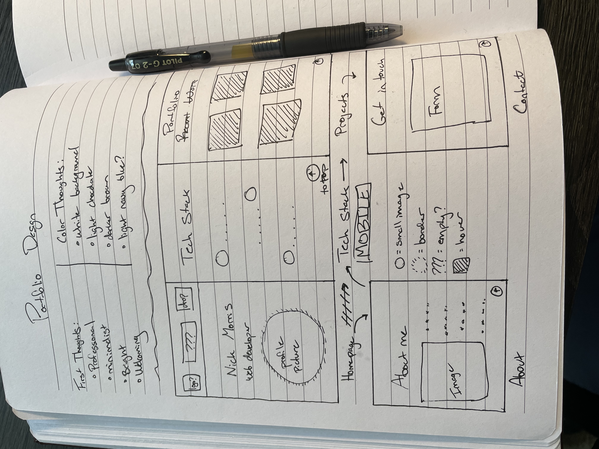
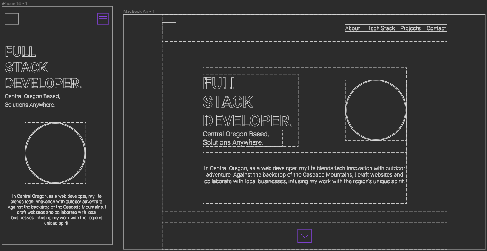
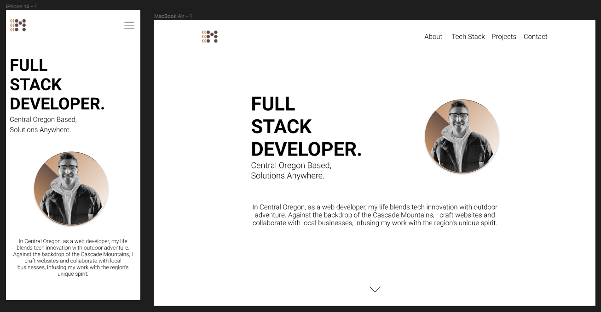
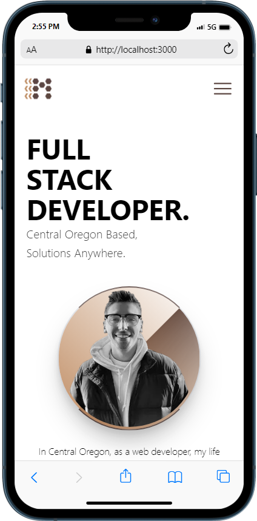

# 📖 Nick Morris's Professional Portfolio

<!-- 

 -->

<!-- ## Description -->

This project is an updated and refined Portfolio which is used to showcase my skills as a developer through the design and projects listed. Nextjs was used allowing my React experience to shine with making use of reusability and separation of concerns and utilizing the mobile first directive of Tailwind. The purpose of this project is to allow anyone to learn a little more about me and view my work.

## 👷 Currently Under Development

As mentioned, this project is still under construction and this README will serve the purpose of documenting my progress and each step I take to finish. This will show everything, meaning I plan to document from beginning to end with images and explanations of my thought process.

I hope anyone who stops by enjoys what I have to say as I craft my new Portfolio page!

## 📜 Usage

Once again, this is my refined Portfolio which takes on a bright and welcoming introduction to myself and my work. My previous Portfolio took on a dark theme which served its purpose at the time, however still fresh out of my Bootcamp, I have learned new design options outside of just dark palates. Making use of whitespace is extremely important. As the old saying goes, "Less is more" and the purpose of this page is to highlight me. The less I focus on this, the more I get away from the purpose of my Portfolio.

### 🔍 Preview

As soon as my Portfolio becomes live, the link will be displayed here. In the meantime, I will have each step I have taken thus far. From my initial brainstorm, to stripped down wireframe concepts, to Figma design, and currently displayed on localhost!

#### 🏡 Homepage

    <ul>
        <li>This was the first step I took when beginning my Portfolio design. Initially, I began by writing down my first few thoughts on what I wanted it to feel like. The points mentioned were...</li>
            <ul>
                <li>Professional</li>
                <li>Minimalist</li>
                <li>Bright</li>
                <li>Welcoming</li>
            </ul>
        <li>The next points I wanted to establish early were the initial color ideas I had pictured in my head. Of course once you add color to the wireframe, you refine what colors you want to use, so this was just establishing some basic groundwork. From the start, I knew I wanted a white background which was the most significant  part. The colors written down were...
            <ul>
                <li>White background</li>
                <li>Light chocolate</li>
                <li>Darker brown</li>
                <li>Light navy blue?</li>
            </ul>
        </li>
        <li>Finally I constructed a very rough outline of my mobile approach to my portfolio. Since understanding mobile app development is so important in this current day of age, I wanted to begin with how I wanted it to look like on mobile. Overall, this was a great step because it meant I wasn't going in blind. Oftentimes when starting a new project, there is not a clear direction which only causes more issues as the project progresses. This was not the case for this project since I had a solid foundation.</li>
    </ul>
    

  

    <ul>
        <li>Once the basic sketchup of my design was finished, I got started on constructing my Figma wireframe. The transition from paper to digital is a huge step since you can directly access information about the contents. That is what is so powerful about using Figma and beneficial for any frontend developer.</li>
    </ul>
    

  

    <ul>
        <li>The final product from Figma gives me everything I need to properly construct in React. The next step is to boot up the npx command for my Nextjs application and get started!</li>
    </ul>
    

  

    <ul>
        <li>Currently, the mobile version is complete which is a direct replica of my design from Figma. As a developer, it is a faster process to build a project from a design in comparison to constructing a design while building. That is why it is important as a Full Stack Developer to understand the entire lifecycle of an application from beginning to end.</li>
    </ul>
    

## 💻 Deployment

As mentioned previously, this project is under construction and will have more deployment information here once finished.

## Final Thoughts

I am extremely excited to document this project in its entirety and view the final result. I have more ideas to expand upon from my first Portfolio and how I want to do things differently. Anyone who follows this project along, I hope you enjoy the process and look forward to the live version soon!
